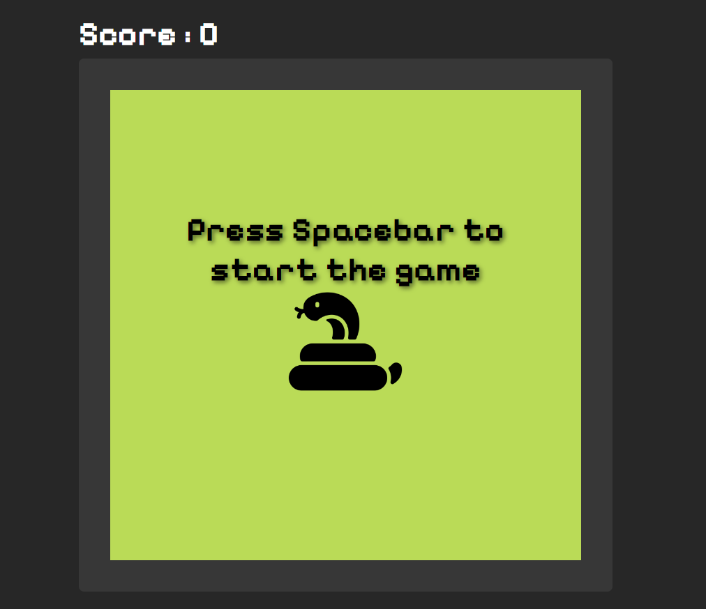

# Snake Game

This is a simple snake game implemented using HTML, CSS, and JavaScript. The game allows the snake to move around a grid, eat food, and grow in size. It includes basic collision detection, scoring, and game reset functionality.

## Demo

## Features

- Snake movement controlled by arrow keys.
- Food randomly generated on the board.
- Score tracking and game reset on collision or game completion.

## Usage
- Use arrow keys to control the snake (Arrow Up, Arrow Down, Arrow Left, Arrow Right).
- Eat the food (green square) to grow the snake and increase your score.
- Avoid colliding with the walls or the snake's own body.

